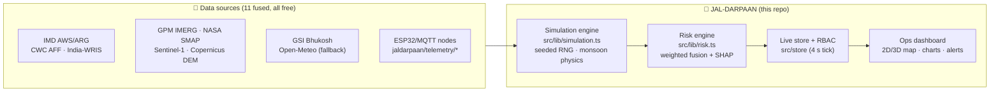
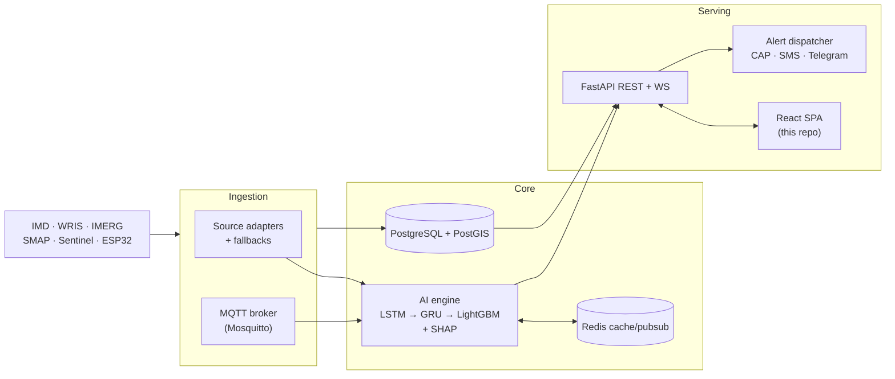
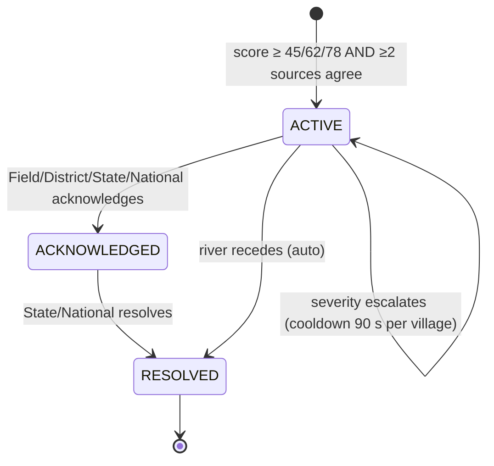
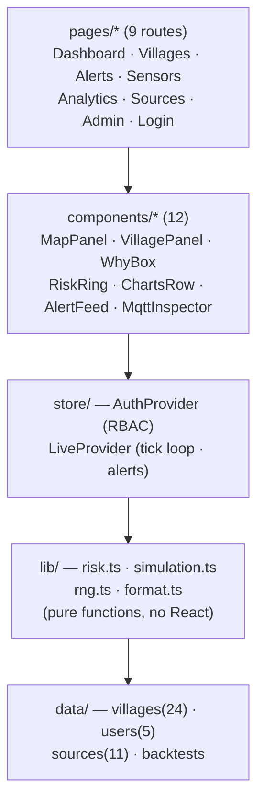
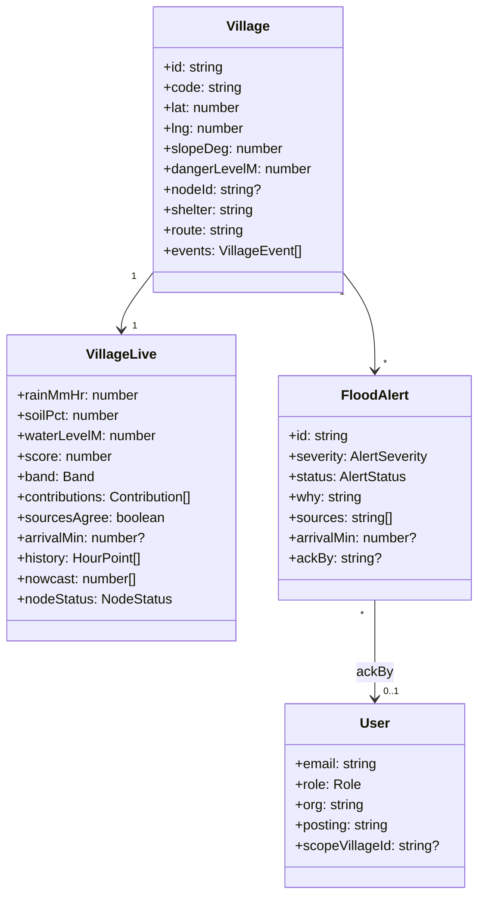
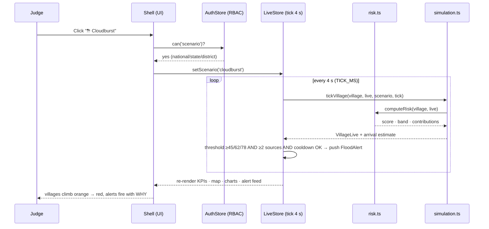
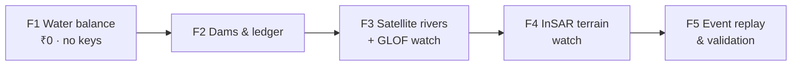
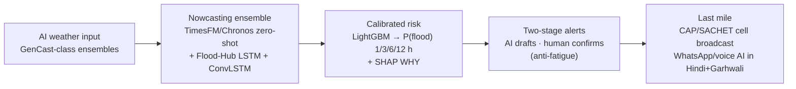

<div align="center">

# 🌊 JAL-DARPAAN

### AI Guardian Against Hill Flash Floods

**SIH 2026 · Problem Statement 26192** · Flash Flood Prediction System for Hilly Regions using Multi-Source Data
Theme: **Disaster Management** · Org: **MHA / NDRF (DM Division)** · Team **BhushaktiAI** · Team ID **184091**


</div>

> Village-level flash flood early warning for the Indian Himalaya — fusing India's **existing**
> IMD/CWC/WRIS station network, free satellite feeds and open-source AI into a live operations
> dashboard with **2D ops map + 3D satellite terrain**, explainable (SHAP-style) alerts, and
> role-based access from **National Command → District EO → Field Officer → Village Pradhan**.

---

## 🚨 Why this exists

Kedarnath 2013. Chamoli 2021. Sikkim GLOF 2023. Dharali 2025. Hill villages get **minutes of warning — or none**.
Existing tools stop at district scale and rainfall alone, while thousands of government stations already sit in the hills, siloed across portals.

| | Existing systems | JAL-DARPAAN |
|---|---|---|
| **Resolution** | District / ~11 km grid (GloFAS, FFGS) | **Village level** (30 m micro-watersheds) |
| **Inputs** | Rainfall only | Rain + **soil** + river level + slope + **slope motion** + event history |
| **Lead time** | Vague 12–24 h regional forecast | **1–3 h hyper-local** with flood-arrival countdown |
| **Alerts** | Black-box, no action info | Explainable (SHAP-style **WHY**) + shelter, route, helpline |
| **False alarms** | Alarm fatigue | **≥2 independent sources must agree** + per-village cooldowns |
| **Cost** | — | **₹0/month** — existing stations + free satellite data + free-tier hosting |

**The pitch line:** *Government already spent crores on these stations — JAL-DARPAAN makes them save lives.*

---

## ⚡ Quick start

```bash
# Prerequisites: Node.js 20+
npm install
npm run dev        # → http://localhost:5173
```

```bash
npm run build      # tsc --noEmit + vite build — zero errors required
npm run preview
```

> The demo frontend runs 100% in the browser on a **realistic simulation engine** (monsoon physics +
> seeded telemetry + failure cases). **A real backend now exists too** — [`backend/`](backend/README.md)
> (FastAPI) implements the PLAN.md §8 contract: JWT auth + RBAC, risk & simulation engines,
> alert lifecycle, ESP32 ingest and `WS /ws/live`. Map satellite tiles & 3D terrain stream from
> open keyless tile services — best viewed online.
>
> ```bash
> # Backend (optional for the UI demo):
> pip install -r backend/requirements.txt
> cd backend && python -m app.seed && python -m uvicorn app.main:app --reload
> ```

---

## 🔑 Demo logins (one-click autofill)

On the login page, **click any role chip** — e-mail & password auto-fill — then press **Sign In**.

| Role chip | E-mail | Password | Authority |
|---|---|---|---|
| 🏛 **National Command** | `national@jaldarpaan.in` | `Demo@1234` | NDRF HQ — everything incl. User Management, Data Sources, drills |
| 🏔 **State Control** | `state@jaldarpaan.in` | `Demo@1234` | USDMA — state view, analytics, sources, issue/resolve alerts |
| 🏢 **District EO** | `district@jaldarpaan.in` | `Demo@1234` | DDMA Rudraprayag — district ops, issue evacuation advisories, drills |
| 🎖 **Field Officer** | `field@jaldarpaan.in` | `Demo@1234` | SDRF — map, alerts, sensors; acknowledge only |
| 🏘 **Village Pradhan** | `village@jaldarpaan.in` | `Demo@1234` | Own-village view — alerts & own village status only |

<!-- ────────────────────────────────────────────────────────────────
     SCREENSHOTS — drop images into /docs/screenshots and uncomment:


──────────────────────────────────────────────────────────────── -->

---

## 🧭 What's inside

Demo map: **Rudraprayag district, Uttarakhand — Mandakini valley** (24 real villages, Kedarnath → Rudraprayag).

| Page | Highlights |
|---|---|
| **Command Center** | KPI strip · **2D risk map ⇄ 3D satellite-terrain flyover** (one toggle) · click any village → drill-down (climate, sensors, SHAP-style WHY, arrival countdown, evacuation card) · 24 h rainfall + 6 h nowcast · soil saturation · river level vs danger line · live alert feed with 2-source confirmation |
| **Villages** | All 24 villages ranked by live risk score → full detail page per village |
| **Alerts** | Filterable log · acknowledge / resolve gated by role · WHY box on every alert |
| **Sensor Network** | 14 ESP32 nodes · battery / signal health · offline & low-battery failure cases · **live MQTT inspector streaming the exact production payload** |
| **AI & Analytics** | Model metrics (AUC 0.87) · ROC curve · confusion matrix · SHAP feature importance · backtests: **Kedarnath 2013, Chamoli 2021, Sikkim 2023** |
| **Data Sources** | 11 fused feeds with live status + automatic fallbacks |
| **User Management** *(National only)* | Role × capability matrix, directory, coverage summary |

### 🌩 The scenario drill (the judge-pleaser)

**Clear skies → Monsoon surge → Cloudburst (Kedarnath-style)** — watch villages turn orange→red in
real time, 2-source-confirmed alerts fire with WHY explanations and flood-arrival countdowns.

---

## 🏗 High-Level Design (HLD)

### End-to-end data flow



### Production architecture (specified — **API layer implemented in `backend/`**)



## 🔄 Alert lifecycle (state machine)



## 🧠 The risk engine — transparent & explainable

```text
score = 100 × ( 0.34·rain₁ₕ + 0.27·soil + 0.17·river + 0.16·slope + 0.06·history )
```

| Band | Score | Colour | Meaning |
|---|---|---|---|
| 🟢 SAFE | < 40 | `#22C55E` | normal monitoring |
| 🟡 WATCH | 40–59 | `#FACC15` | attention |
| 🟠 WARNING | 60–74 | `#F97316` | act: prepare |
| 🔴 CRITICAL | ≥ 75 | `#EF4444` | act: evacuate |

- **2-source rule:** WARNING/CRITICAL fire only when **≥ 2 independent sources agree** (ESP32 node + IMD/IMERG/SMAP) — the false-alarm defence — plus a 90 s per-village cooldown.
- **Explainable:** every alert carries SHAP-style contributions in plain language — *"Soil 92% saturated + 45 mm/hr rain → HIGH risk"* — plus a flood-arrival countdown.
- The linear demo model mirrors the production LightGBM + SHAP feature ranking, so the UI contract never changes when real ML lands.

## 🛰 Telemetry contract (simulator = production, zero code change)

Topic `jaldarpaan/telemetry/{village_code}`:

```json
{"node_id": "ESP32-UK-004", "village_code": "VN-2205", "timestamp": "2026-10-05T14:35:00+05:30",
 "rainfall_mm_hr": 45.2, "soil_moisture_pct": 88.4, "water_level_m": 1.42,
 "battery_pct": 92, "signal_dbm": -67}
```

Real ESP32 nodes (₹1,500/node, only at audited station-coverage gaps) plug into this exact format.

---

## 🧩 Low-Level Design (LLD)

### Module architecture & dependency flow



*Rule: pages → components → store → lib → data. No upward imports — this is what makes the
demo→production swap a one-file change.*

### Class model (domain core)



### Role × capability matrix (RBAC, enforced in `store/auth.tsx`)

| Capability | Nat | State | Dist | Field | Village |
|---|:-:|:-:|:-:|:-:|:-:|
| View map / villages / alerts | ✅ | ✅ | ✅ | ✅ | ✅ |
| Acknowledge alert | ✅ | ✅ | ✅ | ✅ | — |
| Run scenario drill | ✅ | ✅ | ✅ | — | — |
| Issue evacuation advisory | ✅ | ✅ | ✅ | — | — |
| Resolve alert | ✅ | ✅ | — | — | — |
| Sensors page | ✅ | ✅ | ✅ | ✅ | — |
| Analytics page | ✅ | ✅ | ✅ | — | — |
| Data Sources page | ✅ | ✅ | — | — | — |
| User Management | ✅ | — | — | — | — |

## 📐 Sequence — the 4-second tick loop



## 🗂 Project structure

```text
src/
├── components/     # 12 presentational units (MapPanel, WhyBox, RiskRing, AlertFeed…)
├── pages/          # 9 route pages (Dashboard, Villages, Alerts, Sensors, Analytics…)
├── store/          # auth (RBAC matrix) + live (simulation loop, alerts)
├── lib/            # risk engine · simulation · seeded RNG · formatting
├── data/           # 24 villages · users · 11 sources · backtests
└── types.ts        # shared domain contracts

backend/            # ⭐ NEW — FastAPI service (PLAN.md §8)
├── requirements.txt
├── README.md       # setup, endpoints, env vars, smoke test
└── app/
    ├── main.py     # all §8 endpoints + WS /ws/live
    ├── auth.py     # JWT + RBAC (CAP_MATRIX port)
    ├── engine.py   # tick loop + alert engine + broadcast
    ├── simulation.py · risk.py · rng.py   # engine ports (bit-exact RNG)
    ├── seed.py · seed_data.py             # DB seeding (24 villages, 10 users…)
    └── models.py · database.py · config.py
```

---

## 🔮 Future development

Two companion roadmaps carry the full detail — this section is the executive view.

### 🛰 Sensing roadmap — [`docs/FUTURE_PLANS.md`](docs/FUTURE_PLANS.md)

| Phase | Capability | Real free source |
|---|---|---|
| F1 | **Water balance & discharge** — real rainfall volume per region, runoff, ledger (in → stored → released) | Open-Meteo Flood API (GloFAS, no key), GPM IMERG |
| F2 | **Dams & reservoirs** — levels, live-storage %, releases by region, high-storage alert rule | India-WRIS, CWC weekly bulletin, CWC AFF (~350 stations) |
| F3 | **Satellite rivers & GLOF watch** — water-extent change as a confirming source, glacial-lake breach alerts | Sentinel-1/2 NDWI, ICIMOD inventories, SWOT |
| F4 | **Mountain-movement watch (InSAR)** — *is the slope moving before the rain?* per-village mm/yr motion index | Sentinel-1 radar pairs (EGMS methodology) |
| F5 | **Real flash-flood event library** — Kedarnath 2013, Chamoli 2021, Sikkim 2023, Dharali 2025 replayed for measured lead times | GSI Bhukosh, district records |



### 🤖 AI roadmap — [`docs/AI_FUTURE_PLANS.md`](docs/AI_FUTURE_PLANS.md)

*(Where we benchmark against Google Flood Hub, GloFAS, FFGS & NDMA SACHET — and target the gap
nobody covers: village-level + explainable + Himalayan + free.)*



**Headline AI upgrades:** probabilistic alerts (`P(flood) = 78% ± 12%` + uncertainty cone) ·
**counterfactual WHY** ("what would downgrade this?") · zero-shot nowcasting for ungauged
villages · LLM alert drafter in Hindi/Garhwali with human-in-the-loop · citizen WhatsApp reports
as a confirmation source · post-event digital-twin forensics.

### 🚀 Deploy — [`docs/DEPLOYMENT.md`](docs/DEPLOYMENT.md)

**Cloudflare Pages** (frontend, unlimited bandwidth, auto-SPA routing) + **Render** (backend, no
credit card) + **Neon** (free Postgres, no expiry) + **GitHub Actions CI** = **₹0/month**.
Every form field and command is written out in the doc.

---

## 📚 Documentation

| Doc | What's in it |
|---|---|
| [`docs/PLAN.md`](docs/PLAN.md) | Build plan, permission matrix, risk-model spec, data model, future API contract |
| [`docs/DESIGN.md`](docs/DESIGN.md) | Full software design document — HLD, UML, LLD, data dictionary |
| [`docs/FUTURE_PLANS.md`](docs/FUTURE_PLANS.md) | Sensing roadmap — InSAR terrain watch, dams & water ledger, GLOF watch, event replay |
| [`docs/AI_FUTURE_PLANS.md`](docs/AI_FUTURE_PLANS.md) | AI roadmap — existing solutions compared, 2024–26 discoveries, model architecture v2 |
| [`docs/DEPLOYMENT.md`](docs/DEPLOYMENT.md) | GitHub push guide, hosting comparison, exact deploy fields, CI/CD |
| [`backend/README.md`](backend/README.md) | Backend setup, endpoint reference, env vars, smoke test |
| [`docs/DEMO_SCRIPT.md`](docs/DEMO_SCRIPT.md) | 5-minute judge walkthrough script |
| [`docs/SIH_PPT.txt`](docs/SIH_PPT.txt) | SIH 2026 idea-PPT text — all 6 official template slides filled, portal-ready |

## 🗺 Roadmap

- [x] Village dataset, risk engine, alert lifecycle, RBAC, 2D/3D map, scenario drills
- [x] FastAPI backend implementing `PLAN.md §8` — JWT + RBAC, risk/simulation engine port, alert lifecycle, ESP32 ingest, `WS /ws/live` ([`backend/`](backend/README.md); SQLite→Postgres by config; Redis/PostGIS Phase 2)
- [ ] Wire the SPA store to the backend API (HTTP/WS instead of the in-browser tick loop)
- [ ] Real ingestion adapters (IMD/CWC/WRIS + Open-Meteo) with automatic fallbacks
- [ ] Water-balance ledger + dam/reservoir ingestion (`FUTURE_PLANS.md` F1–F2)
- [ ] Satellite water extent + GLOF watch (F3) · InSAR terrain watch (F4)
- [ ] Zero-shot nowcasting + probabilistic alerts (`AI_FUTURE_PLANS.md` AI-1)
- [ ] Event replay harness → measured lead times (F5)
- [ ] Telegram / FCM / SMS dispatch in Hindi + local languages
- [ ] District pilot → 11 Himalayan hill states + Western Ghats

---

<div align="center">

**Team BhushaktiAI** · Smart India Hackathon 2026 · PS 26192

*Government already spent crores on these stations — JAL-DARPAAN makes them save lives.*

</div>
